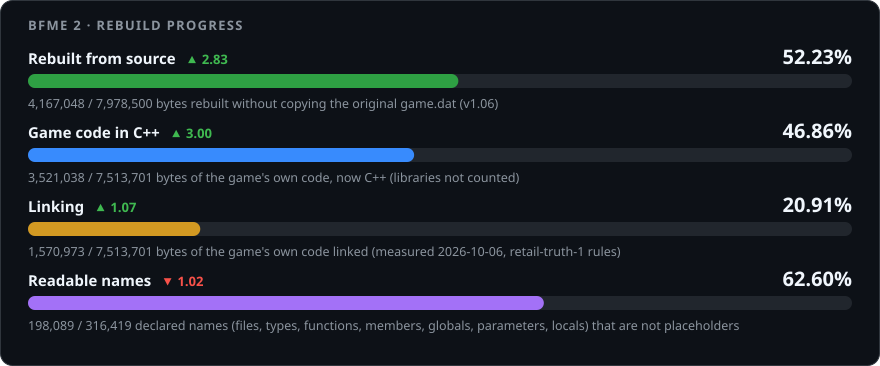
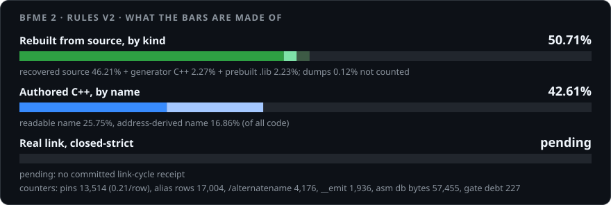
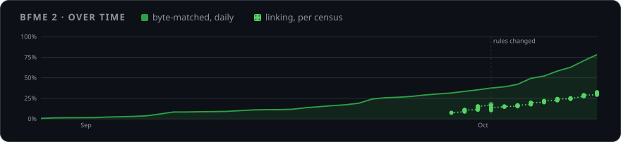
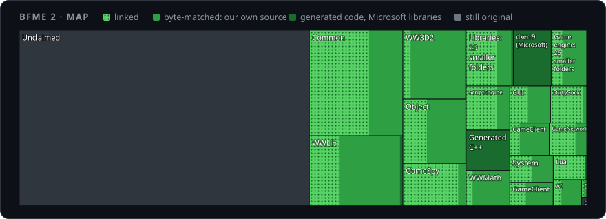

# BFME 2 Source Code

Goal: Source code that rebuilds BFME 2's engine binary (`game.dat`) byte-for-byte, and game modernization improvements that you've only seen in your dreams.

[Join our Discord to participate!](https://discord.gg/wCvA2XqPUT)

## What?

* We rewrite the game's code as C++, one small piece at a time.
* Each piece must turn back into the exact same bytes as the original game.dat (BFME 2, version 1.06).
* When every piece matches and links, the whole game is open source, and we can fix bugs and make mods.

[](tools/progress.py)

[](tools/progress_v2.py)

### What the bars measure

* **Rebuilt from source**: code rebuilding to the original game.dat's exact bytes, partly generated code or prebuilt libraries.
* **Game code in C++**: the game's own code (no libraries) in C++.
* **Linking**: the part of that code in files that link cleanly (link census).
* **Readable names**: declared names that are not placeholders (files, types, functions, members, globals, parameters and locals); not proof of original EA names. Its daily change compares the displayed percentages in percentage points; `· 0.00` means unchanged. The first post has no comparison.

<details open>
<summary><b>Progress over time and code map</b></summary>

[Interactive report](https://open-bfme.github.io/Open-BFME-2/)





</details>

## Status

Retail statically links Visual C++ 7.1's own support libraries, and `tools/lib_probe.py` places
their members without needing an attached row to anchor a window. The vendored
DirectX archives do **not** place — BFME 2 links a later SDK than the Summer
2003 `d3dx9`/`dxerr9` kept here for BFME 1. Flag calibration is proven: 756
Open-BFME-1 bodies transfer to `game.dat` verbatim, so the reference sweeps are
wide open.

## Roadmap

* [ ] BFME 2 Source Code
* [ ] 60/120 FPS
* [ ] Memory fix
* [ ] Better crash logs
* [ ] Multi CPU
* [ ] World builder Source Code
* [ ] Bigger maps
* [ ] RotWK support

Off-host delay is already fixed by the community (BFME 2 patch 1.09v3, RotWK 2.02 v9), so it is deliberately not on this roadmap.

## How You Can Help

Clone the repo and give your AI agent this exact prompt — measured on six agent
sessions, a vaguer prompt reliably produces zero progress:

> Read AGENTS.md and follow it. Loop: take the served candidate's whole file,
> convert bodies to byte-exact C++, bank each verified body as its own commit,
> and before stopping run `python3 tools/progress.py origin/master` — if C++
> exact is +0 bytes, keep going. Make a PR when you have a few landed bodies.

Each commit in the PR is one verified function, and I will be able to merge it.

!! All such AI-generated PRs are appreciated !!

## Build

The baseline executables are committed directly; the MSVC 7.1 toolchain and the
Zero Hour reference source live in the Open-BFME-1 submodule, so clone with
submodules:

```bash
git clone --recurse-submodules https://github.com/Open-BFME/Open-BFME-2.git
cd Open-BFME-2
./tools/setup_hooks.sh   # enable the pre-commit byte-check (git won't do this from a clone)
./build.sh               # verify every tracked function against retail   (.\build.ps1 on Windows)
```

To check a single function while iterating, pass its file or name — a few seconds instead of the full run:

```bash
./build.sh Code/Libraries/Source/Compression/ZLib/trees.c
```
